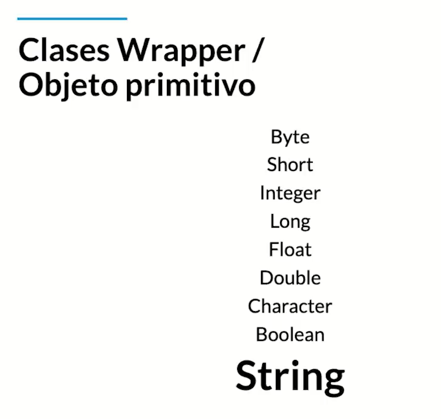
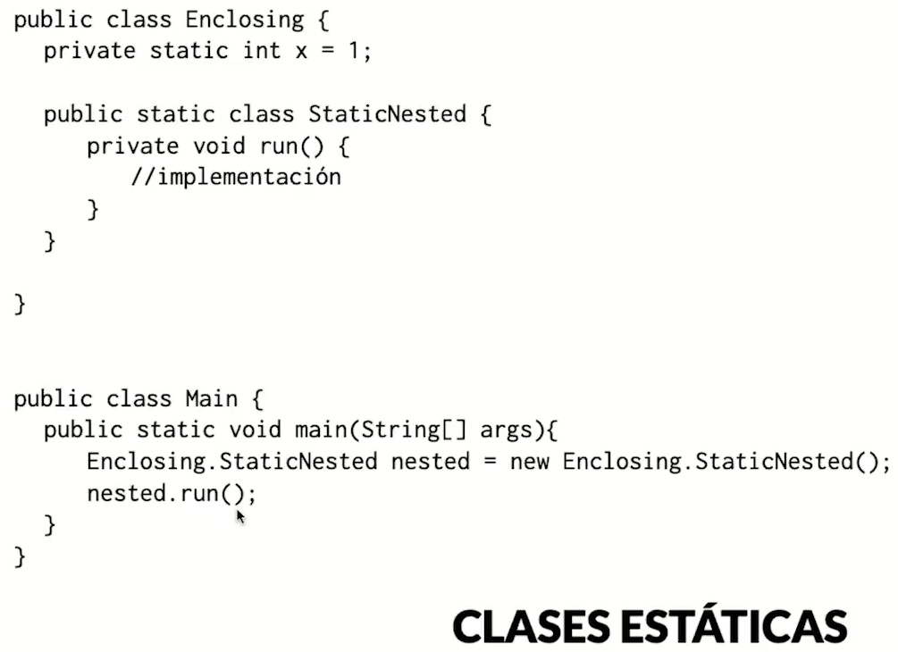
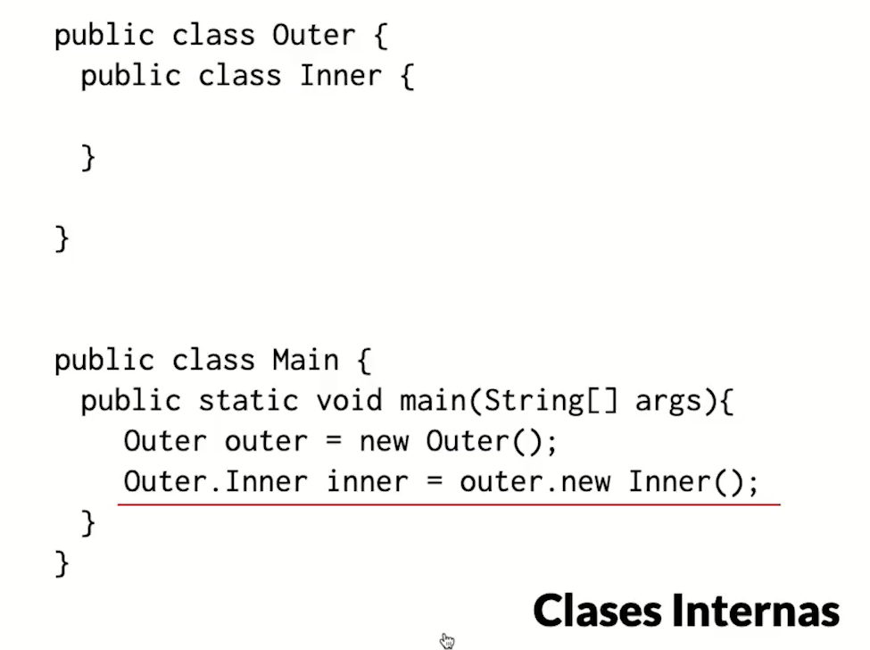
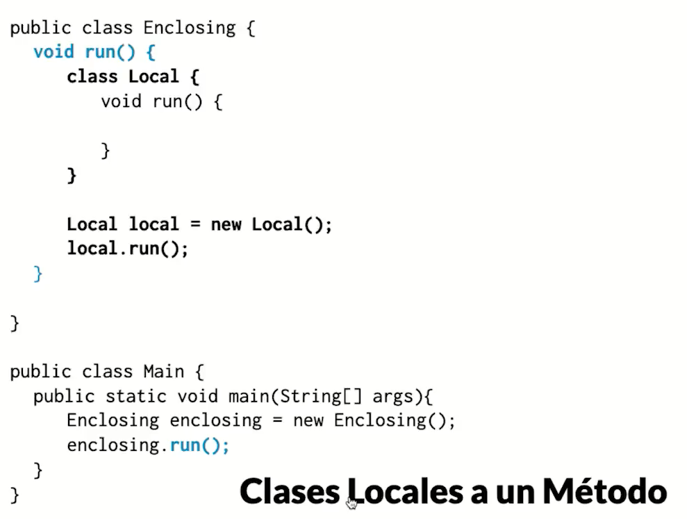

# Medical Appointments

## Key Concepts:

**Objeto:** Cualquier cosa que tenga atributos y comportamientos en el sistema

**Clase:** Modelo de un objeto, es la abstracción del objeto

**MODULARIDAD:** Dividir un Sistema en Subsistemas

### Método Constructor:
* Crea instancias de una clase
* se invoca con el new()
* se llama igual que su clase poseedora
* Java proporciona un metodo constructor por defecto si no se crea

### Static: 
* se puede usar en toda la clase.
* Un miembro *static* le pertenece a la clase no al objeto
* Se usan para llamar un variable sin utilizar un objeto
* Se accesan usando en nombre de la clase y punto
* Para poner miembros estaticos de una manera mas resumida se usa *'import static'*

### Sobrecarga de constructores:
* Métodos con el mismo nombre pero con distintos argumentos, y tipos de retorno
* Los Constructores se sobrecargan
* ej: En la clase doctor serían los constructores ⬇️
```java
 Doctor() { ... }
 Doctor(String name, int age) { ... }
```

### Niveles de acceso
* **protected:** sólo pakage, padre, e hijos
* **default:** sólo pakage, padre
* **private:** sólo padre

### Objetos
* En java los array son objeto

> los obj se viven en heaps en memoria y al instanciar un obj la variable contiene la direccion de memoria


* **Clases Wrapper:** clases equivalentes a los tipos de datos primitivos ⬇️

> los **wrappers** son "envoltorios" para los tipos primitivos y Le ponen métodos <br>
> Se usan mucho en collections

## Clases Anidadas 
* Clase dentro de clase
* pueden ser estáticas o standard:
```java
class ClaseExterior {
    static class ClaseEstaticaAnidada { ... }
    class ClaseInterna { ... }    
}
```
* Las clases anidadas son clases helper para encapsular lógica adicional 

> **Lo mejor es usar clases estáticas anidadas, lo demás es perder el tiempo como lokita**

<br>



> Forma de instanciar objeto de una clase interna anidada



> * que loco se pueden definir clases dentro de un método :O <br>
> * el scope de esta clase está dentro del método que la contiene


### Enum
Un Enum es un tipo de dato que permite definir una colección de constantes