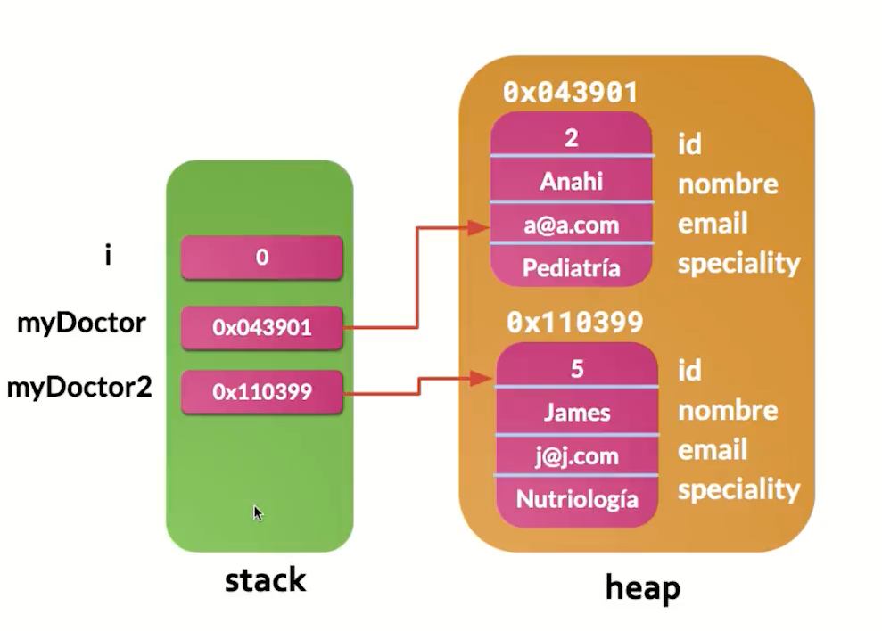
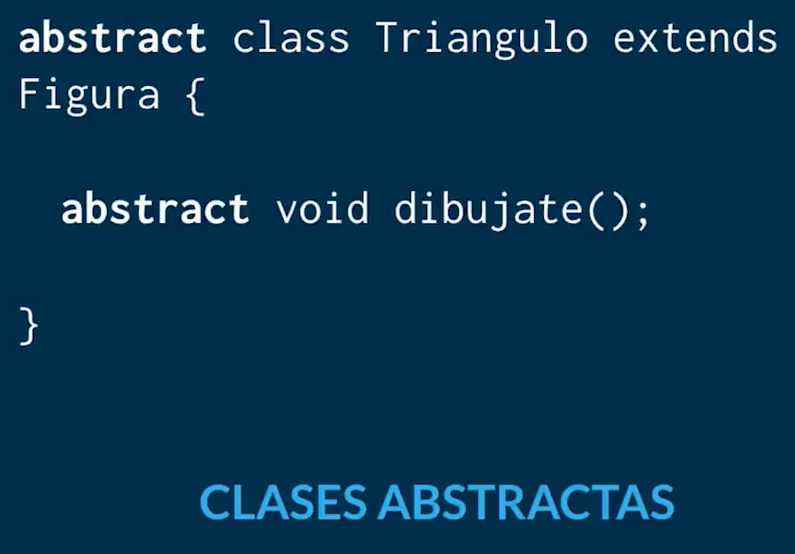

# Medical Appointments!

## Key Concepts:

**Objeto:** Cualquier cosa que tenga atributos y comportamientos en el sistema

**Clase:** Modelo de un objeto, es la abstracción del objeto

**MODULARIDAD:** Dividir un Sistema en Subsistemas

### Método Constructor:

* Crea instancias de una clase
* se invoca con el **new()**
```java
Doctor joaquin = new Doctor("Joaquin", "urologo");
```
* el constructor se llama igual que su clase poseedora
* Java proporciona un metodo constructor por defecto si no se crea

### Static:

* se puede usar en toda la clase.
* Un miembro *static* le pertenece a la clase no al objeto
* Se usan para llamar un variable sin utilizar un objeto
* Se accesan usando en nombre de la clase y punto
* Para poner miembros estaticos de una manera mas resumida se usa *'import static'*

### Sobrecarga de constructores:

* Métodos con el mismo nombre pero con distintos argumentos, y tipos de retorno
* Los Constructores se sobrecargan
* ej: En la clase doctor serían los constructores ⬇️

```java
public class Doctor {
    Doctor() { ... }
    Doctor(String name, int age) { ... }
}
```

### Niveles de acceso

* **protected:** sólo pakage padre e hijos
* **default:**   sólo pakage y padre
* **private:**   sólo padre

### Objetos

* En java los array son objeto
  

> los obj se viven en heaps en memoria y al instanciar un obj la variable contiene la direccion de memoria

* **Clases Wrapper:** clases equivalentes a los tipos de datos primitivos ⬇️
  

> los **wrappers** son "envoltorios" para los tipos primitivos y Le ponen métodos <br>
> Se usan mucho en collections

## Clases Anidadas

* Clase dentro de clase
* pueden ser estáticas o standard:

```java
class ClaseExterior {
    static class ClaseEstaticaAnidada { ...
    }

    class ClaseInterna { ...
    }
}
```

* Las clases anidadas son clases helper para encapsular lógica adicional
  

> **Lo mejor es usar clases estáticas anidadas, lo demás es perder el tiempo como lokita**

<br>


> Forma de instanciar objeto de una clase interna anidada


> * que loco se pueden definir clases dentro de un método :O <br>
> * el scope de esta clase está dentro del método que la contiene

### Enum

* Un Enum es un tipo de dato que permite definir una colección de constantes
* También tiene Contructor, métodos y atributos

```java
enum Day {
    MONDAY("Lunes", "Lundi"),
    TUESDAY("Martes", "Mardi"),
    WEDNESDAY("Miercoles", "Mercredi"),
    THURSDAY("Jueves", "Jeudi"),
    FRIDAY("Viernes", "Vendredi"),
    SATURDAY("Sábado", "Samedi"),
    SUNDAY("Domingo", "Dimanche");
}
```

### SUPER

* El constructor de la padre **SIEMPRE** debe ir al inicio del constructor hijo
  

```java
public Patient(String name, String email) {
    super(name,email);    
}
```
> Constructor padre dentro de constructor hijo

```java
@Override
public String  toString() {
    return super.toString() + String.format("\nAge: %s, \nWeight: %s, \nHeight: %s, \nBlood: %s", getBirthday(), getWeight(), getHeight(), getBlood());
}
```
> sobreescritura de método padre en el hijo

## SOBREESCRITURA (OVERRIDE)

Cuando se hereda un método y se redefine con una implementación distinta a la del padre

* cuando un método es static o final no se puede sobreescribir
* Sobreescritura de Constructor: reescribir el constructor del hijo con argumentos diferentes

### toString() Override:

* Método de la clase *Object* que es por defecto el papá de todas las clases de manera implicita
* al ejecutar System.out.println(objeto) se está ejecutando .toString()
* .tosString() por defecto trae el nombre de la clase más un hashCode
* por eso se modifica su comportamiento con un @Override en los hijos
* Aquí se hizo Override de .toString() de model.User model.Patient y model.Doctor

## Polimorfismo

* Es sobreescribir un método con comportamientos diferentes
* La **sobrecarga** y la **sobreescritura** son tipos de polimorfismo

## INTERFACES

* Se enfocan en encapsular comportamiento redundante
* Comportamientos que pueden ser reutilizables
* Es un contrato que sólo define los métodos y tipos de retorno
* JAMÁS tiene bloques de código
* permiten  "simular" herencia múltiple
* buena práctica que comiencen por **I**(i) y terminen por **able**
* palabra reservada **implements**

## COMPOSICIÓN

* Implementar los métodos de una Interface
* Añadirle comportamientos a una clase
* Composición de interfaces en clases
* Como componer una clase de más comportamientos
* Los métodos se abstraen en interfaces


> UML general del proyecto

## COLLECTIONS

* Son como una caja de herramientas donde cada herramienta es un objeto
* Es una forma eficiente de trabajar con conjuntos de objetos de manera eficiente
* [Collections según gemini ](https://g.co/gemini/share/2939feec743c)


> Jerarquía de los collections en Java

### ¿Cuándo usar cada tipo de colección?
* **List:** Cuando necesitas mantener un orden específico de elementos y acceder a ellos por índice.
* **Set:** Cuando necesitas garantizar que no haya elementos duplicados y el orden no es importante.
* **Map:** Cuando necesitas asociar un valor a una clave única.
* **Queue:** Cuando necesitas procesar elementos en el orden en que fueron añadidos.

****

> Diagrama de decisión para uso de collections en Java

```java
import java.util.ArrayList;
import java.util.List;

public class EjemploColecciones {
    public static void main(String[] args) {
        List<String> frutas = new ArrayList<>();
        frutas.add("Manzana");
        frutas.add("Banana");
        frutas.add("Pera");

        for (String fruta : frutas) {
            System.out.println(fruta);
        }
    }
}
```

## CLASES ABSTRACTAS

Los métodos obligatorios son los que tienen la palabra reservada **abstract**

```java
abstract void dibujate();
```

* Las clases abstractas siempre serán padres
* Son una combinación de entre Interface y Herencia
* **No** implementan todos los metodos
* **No** crean instancias


> * Resuelve el problema de las Interfaces que obligan a implementar todos los metodos
> * Resuelve el problema de la Herencia de instanciar clases superiores innecesariamente porque son muy genéricas


### Implementación parcial de clases Abstractas


> Al hacer la clase User abstracta ya no permite instanciar objetos
****

> Aquí se aplica un modelo de polimorfismo para instanciar una clase usando a sus hijos ya que tienen la implementación
> de user

### Métodos Obligatorios en una clase Abstracta


### Clase hija abstracta

> * la clase hija abstracta debe **declarar los metodos obligatorios del padre**
> * La clase concreta que herede de la hija abstracta debe implementar los metodos obligatorios usando **polimorfismo**
    
    